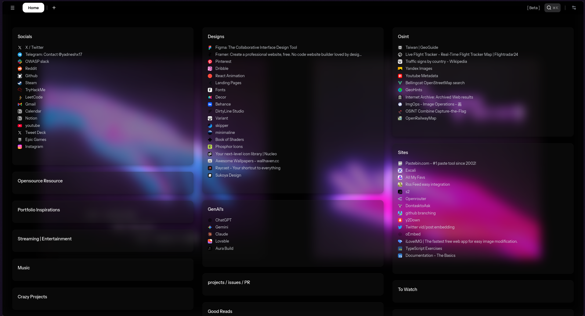
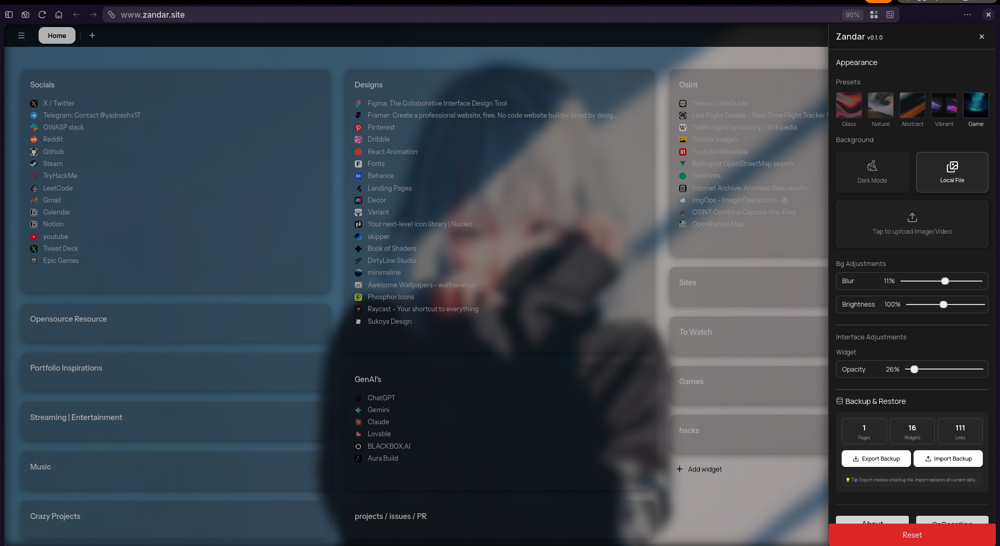

# Zandar 

**A local-first, privacy-focused & highly customizable browser startpage**.
An open-source alternative to StartMe.

*(New tab view showing the dashboard)*

*(Settings Preview)*

---

## Self-Hosting / Development Setup

Using Docker (Recommended)
Build the Image

docker build -t zandar-app .
Run the Container

docker run -p 3001:3001 zandar-app
Using Docker Compose
Start the Service

docker compose up -d --build
This works identically to the manual docker run command, mapping port 3001.

Access the App Open http://localhost:3001.

---
Using Node.js Directly
If you prefer to run it without Docker (requires Node.js v20+):

Install Dependencies

npm run install-all
Build Frontend

npm run build
Start Backend

npm run start
The app will be available at http://localhost:3001.
---
Your content lives entirely in your browser session. Please export your data if you intend to use it from different browsers
